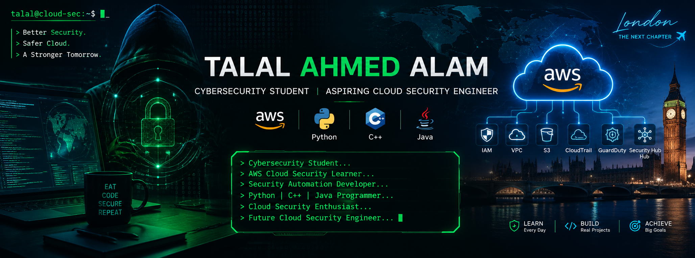

<!-- ===================== MAIN BANNER ===================== -->

  

<!-- ===================== TYPING ANIMATION ===================== -->

---

# 👋 Hello, I'm Talal Ahmed Alam

🎓 **BS Cybersecurity Student**

☁️ **Aspiring AWS Cloud Security Engineer**

🔐 **Cybersecurity & Security Automation Enthusiast**

💻 **Python | C++ | Java Programmer**

🐧 **Linux & Networking Learner**

---

# 🧠 About Me

I'm currently pursuing a **Bachelor's degree in Cybersecurity** and building my skills through university coursework, security labs, programming projects, and independent learning.

My primary interests are **Cloud Security, Cybersecurity, Network Security, Security Automation, and Secure Infrastructure**.

I'm particularly interested in understanding how cloud environments can be securely designed, monitored, automated, and protected.

I currently work with **Python, C++, Java, Linux, Git, GitHub, networking tools, and cybersecurity technologies** while expanding my knowledge of **Amazon Web Services (AWS)**.

My long-term goal is to develop the practical knowledge and engineering skills required for a career in **Cloud Security Engineering**.

---

# ✨ Currently Learning & Exploring

💻 Continuously improving my programming skills through **Python, C++, and Java**, with a focus on clean code and security automation.

☁️ Exploring **AWS Cloud Security** and learning how cloud infrastructure can be securely designed, configured, monitored, and protected.

🔐 Learning **Identity & Access Management (IAM)**, least-privilege access, authentication, authorization, and secure access-control practices.

🌐 Strengthening my knowledge of **Computer Networks & Network Security**, including TCP/IP, DNS, HTTP/HTTPS, firewalls, packet analysis, and secure networking.

🐧 Gaining hands-on experience with **Linux**, focusing on command-line tools, permissions, processes, networking, administration, and security.

🔍 Learning **Digital Forensics & System Analysis** to better understand security incidents, system artifacts, and digital evidence.

🤖 Exploring **Security Automation with Python** to automate repetitive security tasks, analyze logs, verify file integrity, and improve security workflows.

🧩 Practicing **Data Structures & Algorithms** to strengthen problem-solving abilities and programming fundamentals.

---

# 🎯 My Goals

☁️ Build a strong practical foundation in **AWS Cloud Security** and secure cloud infrastructure.

🔐 Develop knowledge of **IAM, VPC, EC2, S3, CloudTrail, logging, monitoring, encryption, and access control**.

🐍 Improve my **Python scripting and automation skills** for cybersecurity and cloud-security tasks.

🌐 Strengthen my understanding of **networking and network security**, including TCP/IP, DNS, HTTP/HTTPS, firewalls, and traffic analysis.

🐧 Become confident working with **Linux systems**, command-line tools, permissions, networking, and security utilities.

🛡️ Build practical **cybersecurity and cloud-security projects** to complement theoretical knowledge.

🤝 Contribute to **open-source projects** related to cybersecurity, cloud computing, automation, and software development.

🚀 Continuously develop the technical skills required for a future career in **Cloud Security Engineering**.

---

# ⚙️ Tech Stack

## 💻 Programming Languages

## ☁️ Cloud & Security

## 🛠️ Development & Security Tools

  

---

# 🧩 Featured Project

## 🛠️ [Cisco Security Auditor](./cisco-security-auditor)

An automated network compliance and configuration vulnerability scanner built using **Python and Netmiko**.

The script securely connects to distributed networking endpoints via SSH, parses running configuration files, and dynamically flags baseline security flaws—such as unsecure administrative protocols (Telnet/HTTP), weak authentication flags, and missing access control lists (ACLs).

### ⚙️ Tech Stack

`Python` • `Netmiko` • `SSH` • `Data Parsing` • `RegEx`

### 🔍 Key Areas

- Network configuration auditing
- Automated security checks
- SSH-based device communication
- Configuration parsing
- Vulnerability identification
- Network security automation

### 👉 [Explore the Repository Code](./cisco-security-auditor)

---

# 📊 GitHub Analytics

---

# 📈 GitHub Activity Graph

---

# 🌐 Connect With Me

---

# ☁️🔐

### *“Engineer the cloud for scale. Secure it for trust. Defend it by design.”*

 

  

**☁️ Cloud Security &nbsp; • &nbsp; 🔐 Cybersecurity &nbsp; • &nbsp; 🤖 Automation &nbsp; • &nbsp; 🌐 Networking**

